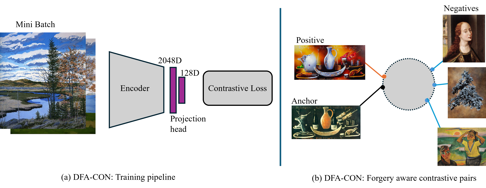
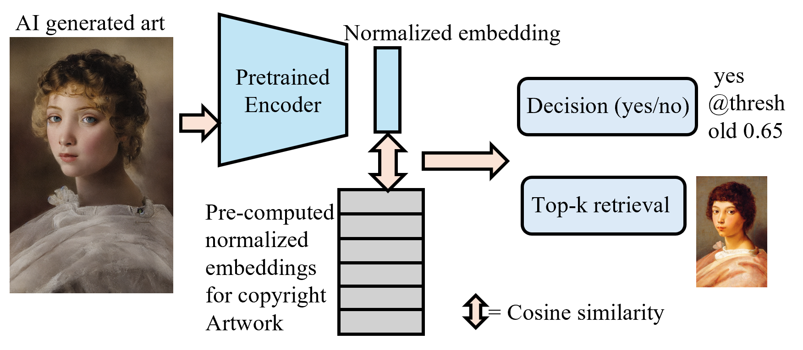

# DFA-CON

Official repository for the paper **“DFA-CON: A Contrastive Learning Approach for Detecting Copyright Infringement in DeepFake Art”**, accepted at **IEEE MLSP 2025 [Link](https://ieeexplore.ieee.org/abstract/document/11204260)**.

## Overview

DFA-CON is a contrastive learning framework for detecting copyright infringement in AI-generated visual artworks. It learns an embedding space in which original artworks and their forged variants are pulled closer, while unrelated images are pushed apart.

This repository includes:
- contrastive training pipeline,
- similarity-based evaluation pipeline,
- wrappers for comparing against pretrained visual foundation models.

## Method

### DFA-CON Framework

<p align="center">
  
</p>

DFA-CON consists of three main components:
1. **Forgery-aware contrastive sampling**
2. **Representation learning** using an encoder and projection head
3. **Supervised contrastive loss** for training

### Inference Pipeline

<p align="center">
  
</p>

At inference time, a generated image is encoded into an embedding, compared against a reference bank of copyright-protected artwork embeddings using cosine similarity, and classified as potential infringement or non-infringement using a threshold.

## Features

- Supervised contrastive training with forgery-aware sampling
- Support for **ResNet-50**, **ViT**, **CLIP**, and **DINO-v2**
- Modular model wrapper for rapid comparison with new embedding models
- Batch inference for efficient evaluation
- Per-attack evaluation on:
  - Inpainting
  - Style Transfer
  - Adversarial Perturbation
  - CutMix

## Repository Structure

```text
DFA-CON/
├── configs/          # YAML configuration files
├── data/             # Dataset parsing and loading utilities
├── eval/             # Model wrappers and evaluation utilities
├── loss/             # Contrastive loss implementations
├── models/           # Backbone and projection head definitions
├── scripts/          # Training and evaluation entry points
├── train/            # Training loop and scheduler logic
├── assets/           # Figures for README / poster
└── requirements.txt
```
##Installation
Clone the repository and install dependencies:
```text
git clone https://github.com/your-username/DFA-CON.git
cd DFA-CON
pip install -r requirements.txt
```
## Dataset
This work uses the DeepfakeArt Challenge benchmark, which contains image pairs corresponding to similar and dissimilar cases across multiple forgery types.

The dataset is not included in this repository. Please obtain it from the [official benchmark source](https://www.kaggle.com/datasets/danielmao2019/deepfakeart) and organize it according to the directory structure expected in the configuration files.

## Training
Run training with:
```text
python scripts/run_train.py --config configs/train_config.yaml
```
Example configuration fields:

```text
model_name: dfa_con_rn
head_type: mlp
feature_dim: 128
batch_size: 128
lr: 0.01
epochs: 100
warmup_epochs: 20
patience: 10
loss_name: supcon
data_root: /path/to/deepfakeart
```
## Evaluation
Run evaluation with:
```text
python scripts/evaluate.py --config configs/evaluate_config.yaml
```
The evaluation pipeline:
- computes normalized embeddings,
- finds the best threshold on a validation or training split,
- applies cosine similarity-based binary classification,
- reports Precision, Recall, and F1-score,
- supports both overall and per-attack analysis.

## Supported Models
The evaluation framework supports comparison against several pretrained encoders through a unified wrapper interface.
Currently supported:
- dfa_con_rn
- resnet50_imagenet
- clip_vitb16
- vit_dino
- dinov2_vitl14

To add a new embedding model, modify:
```text
eval/model_wrapper.py
```
## Results
DFA-CON outperforms several general-purpose pretrained visual foundation models on the DeepfakeArt benchmark, particularly on:
- Inpainting
- Style Transfer
- Adversarial attacks

Performance drops on CutMix, indicating that compositional forgeries remain a challenging setting and an important direction for future work.

## Reproducibility
The codebase is modular and supports:
- easy model swapping,
- configurable training and evaluation,
- rapid benchmarking across embedding models.

## Citation
If you find this repository/work useful, please cite:
```text
@inproceedings{dfacon2025,
  title     = {DFA-CON: A Contrastive Learning Approach for Detecting Copyright Infringement in DeepFake Art},
  author    = {Haroon Wahab, Hassan Ugail and Irfan Mehmood},
  booktitle = {IEEE MLSP},
  year      = {2025}
}
```

## Acknowledgements
This work builds on:
- the [DeepfakeArt Challenge benchmark](https://www.kaggle.com/datasets/danielmao2019/deepfakeart)
- Supervised Contrastive Learning ([SupCon](https://arxiv.org/abs/2004.11362))
- publicly available pretrained visual encoders including CLIP, DINO-v2, ViT.
  
